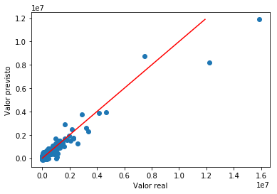

# Machine Learning Engineer Nanodegree
## Projeto final - Projeto Capstone
Helton Souza Lima

Junho, 2019

## I. Definição

### Visão geral do projeto
O Programa Bolsa Família (PBF) é o maior programa de distribuição de renda do Brasil [1], através de um benefício em dinheiro transferido diretamente do governo federal para famílias dentro da linha da pobreza e extrema pobreza, para garantir um alívio mais imediato à pobreza, complementando a renda dessas famílias e condicionando à participação nos serviços de saúde e educação. De acordo com o artigo da Dra. Daniela Dias Kuhn [2], o programa foi efetivo na melhoria dos índices de desenvolvimento humano no Estado do Rio Grande do Sul. Podemos citar outro estudo, realizado em Minas Gerais [3] que aponta a mesma conclusão no âmbito deste estado.

Por outro lado, é recorrente a veiculação de notícias [4] referentes a fraudes nos benefícios do Programa Bolsa Família. Essas fraudes acarretam saques de valores superiores ao necessário para o atingimento do objetivo do programa e precisam ser eliminadas, pois acarretam um custo desnecessário ao governo, chegando ao patamar de bilhões [5] de reais. 

A empresa em que trabalho é a DATAPREV [6], empresa de processamento de dados do governo federal. Uma atividade recorrente de nossa empresa é o levantamento e cruzamento de informações entre bases de dados para verificar o correto cumprimento de políticas públicas através de sistemas informatizados. O trabalho com os dados do Bolsa Família permitirá a investigação de situações semelhantes a outras que fazem parte das recorrentes demandas dentro da empresa, e a experiência poderá ser útil dentro de um contexto semelhante ao problema abordado neste trabalho.

### Descrição do problema
O público-alvo do PBF são as pessoas que estão dentro da faixa da pobreza ou pobreza extrema. Entende-se que os volumes financeiros disponibilizados para o programa é proporcional à quantidade de pessoas dentro das faixas sociais que são alvo do programa, de forma que, a partir de dados de informações sociais e econômicas, como a população total, esperança de vida ao nascer, taxa de analfabetismo, percentual de crianças na escola, taxa de frequência, renda per capita, percentual de distribuição de renda, proporção de pobres, etc, é possível predizer o volume financeiro a ser utilizado para o PBF. Em suma, este trabalho visa verificar se municípios com índices mais baixos (índices que compõem o IDH) recebem mais recursos do PBF, pois correspondem a municípios mais pobres. De forma análoga, em tese, municípios com índices mais altos recebem menos recursos do PBF, considerando a quantidade de pessoas residentes nesses municípios.

Uma das respostas que se desejou responder foi: Será que existem municípios com alto IDHM mas que, mesmo assim, recebem muitos recursos do PBF, em comparação com outros municípios semelhantes?
Sendo assim, de posse dos dados granularizados a nível de município brasileiro, relativos à pesquisa de mapeamento do Índice de Desenvolvimento Humano Municipal (IDHM) no ano de 2010, utilizou-se modelos de machine learning que foram treinados utilizando-se os dados de parte desses municípios e foram capazes de predizer o volume financeiro da outra parte desses municípios. Em um momento inicial, a análise dos dados apontou a correlação entre os indicadores sociais e o volume financeiro do PBF associado com cada município. Em seguida, foi possível identificar alguns municípios que apontaram discrepância nessa correlação e foram apontados como municípios onde é possível que tenha sofrido uma maior influência de fraudes. 

### Métricas
O valor a ser previsto é um valor contínuo, correspondente ao valor, em reais, que é disponibilizado para ser sacado pelos beneficiários do Bolsa Família para cada município. A métrica que foi utilizada é o R-squared (ou R2), pois é uma métrica que avalia a distância entre o valor previsto e o valor real. Essa métrica é calculada pelo próprio scikit-learn comparando os valores previstos e os valores reais, através da utilização do método "score" dos modelos de regressão. O R2 é definido como (1 - u/v), onde u é soma das diferenças ao quadrado (quadrado(real - previsto)).sum() e v é o total da soma dos quadrados (quadrado(real - média(real))).sum(). A melhor possibilidade é o valor de "score" ser 1.0 e pode ser negativo se o modelo se comportou de forma muito ruim [11]. 

## II. Análise

### Exploração dos dados
Os dados utilizados foram obtidos de duas fontes. A primeira fonte são os dados relacionados ao Índice de Desenvolvimento Humano Municipal (IDHM), disponibilizado pelo site Atlas do Desenvolvimento Humano no Brasil [7] ou no site da Kaggle [8]. Os dados do IDHM são disponibilizados para cada um dos 5565 municípios brasileiros, sendo composto por dados que podem ser agrupados em 3 dimensões: dados sobre longevidade, dados sobre o nível de acesso ao conhecimento e dados sobre a renda. O cálculo do IDHM foi realizado a partir das informações dos 3 últimos Censos Demográficos do IBGE (1991, 2000 e 2010). Neste trabalho foram utilizados os dados do IDHM de 2010.

A segunda fonte são os dados relacionados à quantidade de famílias beneficiárias e o total de pagamentos disponibilizados pelo PBF para cada município brasileiro. Os dados são disponibilizados pelo Ministério da Cidadania [9]. Os dados utilizados são de janeiro de 2010, ou seja, 7 anos após o ano de lançamento do PBF, que pode ser considerado como suficiente para o programa ter atingido uma maturidade em sua operacionalização e gestão e os dados serem considerados consolidados. Também são dados que coincidem com o ano da realização do Censo, em 2010, como forma de aproximar o levantamento social realizado pelo Censo dos dados de recursos disponibilizados pelo Bolsa Família.

#### União dos dados
A primeira etapa do trabalho foi a união de ambas as fontes de dados para formar um único conjunto de dados. O resultado final é composto de 5565 linhas (correspondentes a cada município) e 241 colunas (4 colunas dos dados do Bolsa Família, incluindo a _Quantidade de Famílias Beneficiárias do Bolsa Família_ e o _Valor Repassado para Bolsa Família_, e 237 colunas dos dados para composição do IDHM).

#### Tratamento de variáveis categóricas
 * Foram identificadas 7 colunas com valores não-numéricos e de códigos pertencentes a domínios:
   * **ano**: Sempre o mesmo ano em todas as linhas (2010)
   * **codmun6, ibge, codmun7**: Códigos identificadores do município
   * **município**: Nome do município
   * **anomes**: Competência (mês + ano) do valor diponibilizado pelo Bolsa Família, sempre com valor "201001", que significa janeiro de 2010.
   * **uf**: Código do IBGE identificador da Unidade de Federação ao qual o município pertence.
 * Todas essas variáveis foram removidas para a continuação da análise exploratória e alimentação dos modelos de predição.

#### Transformação de valores
Através da exploração inicial dos dados, verificou-se que a variável **idhm** possuía alguns registros entre 0 e 1 e o restante dos registros entre 400 e 900. Em verificações individuais destes casos, percebeu-se que os registros estavam apenas transformados para valores entre 0 e 1. Por exemplo, para o município de Cabixi, em Rondônia, o valor que se verificou foi 0,65. Entretanto, após pesquisa no portal Atlas Brasil, este município foi avaliado com IDHM 650. 

Portanto, decidiu-se realizar a transformação destes casos para que todos ficassem com a mesma base. O mesmo procedimento foi realizado para **idhm_e, idhm_l, idhm_r, i_freq_prop e i_escolaridade**.

#### Dados ausentes e outliers
Não foram identificados dados ausentes no conjunto de dados, após a realização de busca por lacunas. Em relação aos _outliers_, nenhum caso foi interpretado como _outlier_. Todas as variáveis analisadas individualmente apresentaram distribuição normal ou distribuição normal mista, com dois picos. Foram avaliadas individualmente as variáveis **valor_repassado_bolsa_familia, qtd_familias_beneficiarias_bolsa_familia, idhm, idhm_e, idhm_l, idhm_r, i_freq_prop, i_escolaridade, theil, gini, pmpob, pind e pesotot**. 

### Visualização Exploratória

#### Variáveis avaliadas individualmente através de gráficos
Conforme relatado na seção anterior, as variáveis avaliadas individualmente foram analisadas através de gráficos que estão a seguir. A escolha das variáveis analisadas individualmente nesta fase de exploração dos dados foi apenas baseado no sentimento de importância das variáveis, dadas as informações obtidas no atlasbrasil.org.br :

##### valor_repassado_bolsa_familia
 * Grande parte dos municípios recebe até 100 mil reais. A quantidade de municípios com valor maior que 200 mil reais está em torno de 25%
 * 

##### qtd_familias_beneficiarias_bolsa_familia
 * Grande parte dos municípios possui até mil famílias beneficiadas. A quantidade de municípios com mais de 2 mil famílias beneficiárias está em torno de 25%. O maior valor é 181531 família beneficiárias.
 * 

##### idhm
 * Índice de Desenvolvimento Humano do Município. É uma distribuição normal mista, com dois pontos de picos, próximo dos valores 600 e 720. O menor valor é 418 e o maior é 862.
 * 

##### gini
 * Mede o grau de desigualdade existente na distribuição de indivíduos segundo a renda domiciliar per capita. Seu valor varia de 0, quando não há desigualdade (a renda domiciliar per capita de todos os indivíduos tem o mesmo valor), a 1, quando a desigualdade é máxima (apenas um indivíduo detém toda a renda).O universo de indivíduos é limitado àqueles que vivem em domicílios particulares permanentes.
* 

##### pmpob
 * Proporção dos indivíduos com renda domiciliar per capita igual ou inferior a R$ 140,00 mensais, em reais de agosto de 2010. O universo de indivíduos é limitado àqueles que vivem em domicílios particulares permanentes.
 * 

##### pind
 * Proporção dos indivíduos com renda domiciliar per capita igual ou inferior a R$ 70,00 mensais, em reais de agosto de 2010. O universo de indivíduos é limitado àqueles que vivem em domicílios particulares permanentes.
 * 

##### pesotot
 * População total de cada município
 * 

#### Análise de variáveis correlacionadas

##### Gráfico de correlação
 * Foram utilizados gráficos de correlação para avaliar se haviam variáveis com forte correlação e pudessem ser eliminadas do modelo sem perda de informação relevante para a fase de predição.
 * 

### Algoritmos e técnicas
Para este trabalho, foi tomado como premissa que existe uma relação linear entre as variáveis que compõem o IDHM e o valor repassado para o Bolsa Família. Ou seja, quanto mais baixo o IDHM, maior é o valor proporcional à população do repasse de verbas referente ao Bolsa Família. Portanto, as características deste problema apontam que existem variáveis dependentes de forma linear às variáveis independentes. Sobre a existência de outliers, não foram identificados casos que pudessem se caracterizados como tal, mesmo considerando as grandes capitais brasileiras em que o volume de recursos do Bolsa Família é bem maior do que a grande maioria dos outros municípios. Entende-se que há uma relação linear com a população residente em cada município.

Os valores que se deseja predizer já existem dentro do conjunto de dados, de forma que foi possível calcular a acurácia dos algoritmos escolhidos. Todos os algoritmos escolhidos são para problemas de regressão, pois a intenção é predizer valores contínuos.

#### Regressão Linear
Este é o modelo mais usado para soluções lineares [12] por sua simplicidade e performance na fase de treinamento e predição. A desvantagem desse algoritmo é a sua sensibilidade em relação a outliers, caso existam.

#### Árvore de decisão
Modelo baseado em árvore e são fáceis de entender e visualizar [13]. Suporta variáveis categóricas ou numéricas e é capaz de resolver problemas com múltiplas saídas. Entre as desvantagens estão a criação de árvores que levem ao _overfitting_ e no caso de pequenas variações nos dados de entrada é possível que a árvore gerada mude bastante assim como as predições realizadas.

#### Floresta aleatória
É um modelo composto em que múltiplas árvores de decisão são combinadas para um modelo mais robusto [14], com maior acurácia e imune a sobre-ajustes. Entre as desvantagens estão menor performance quando a floresta cresce e menor entendimento sobre as suas predições.

#### Huber Regressor
É um modelo de regressão linear, porém mais imune a _outliers_ [15].

#### Linear Support Vector Machine
É um modelo que se comporta bem com um número grande de variáveis porém com amostra pequena [14]. Entre as desvantagens está sua complexidade e performance que degrada muito quando a amostra aumenta.

### Modelo de referência
 * O modelo utilizado como referência foi o de **Regressão Linear**, por ser o mais utilizado para este tipo de problema e tem boa performance na fase de treinamento e predição [12].

 * Não encontramos algum trabalho que realizou trabalho semelhante para que possamos realizar uma comparação direta.

## III. Metodologia

### Pré-processamento dos dados
Foram realizados diretamente no Excel a união dos dados e a transformação de valores para uma mesma base, conforme relatado em sessão anterior.

Em seguida, o que mais chamou a atenção na análise exploratória dos dados foi a quantidade de variáveis existentes no conjunto de dados referentes ao cálculo do IDHM: 237 variáveis. Uma hipótese levantada no início do trabalho e que norteou a preparação dos dados foi a possibilidade de eliminar variáveis que fossem redundantes para alimentação de modelos de machine learning. Sendo assim, como primeiro passo foram eliminadas as variáveis categóricas e, em seguida, aquelas com forte relação e que agregariam muito pouco aos modelos em relação à capacidade de predição, sendo apenas informações que deixam o processamento mais lento.

Para a identificação da relação entre as variáveis, foram utilizados gráficos de correlação. Cada gráfico conseguiu exibir a correlação de aproximadamente 90 variáveis (quando temos 237). Por isso, foi necessária a renderização de 8 gráficos com eliminações sucessivas. No total, foram eliminadas 76 variáveis, restando 161 variáveis para alimentar os modelos. Adicionalmente foi utilizado o **SelectKBest** como algoritmo de verificação das variáveis mais significativas, afim de evitar eliminações que viessem a prejudicar a predição dos modelos de aprendizado. Mesmo assim, foi observado, através do _ScatterPlot_ que mesmo entre as variáveis com maior peso, havia correlação muito forte entre elas, sendo possível ainda mais eliminações.

Por fim, foram verificados que não havia nenhuma variável com valores nulos.

### Implementação
Para o treinamento dos modelos, foi realizado a separação dos dados em conjunto de treinamento e conjunto de teste, através do método _train_test_split_ da biblioteca Scikit-Learn. Como esta separação pode ser randômica a cada execução, foi utilizado o parâmetro **random_state** para não haver mudanças nesta separação a cada execução. Percebeu-se que, com diversas separações diferentes, alguns modelos tiveram _scores_ razoavelmente diferentes entre si.

Todos os algoritmos apresentados em sessão anterior foram usados de forma idêntica, com os mesmos dados de treinamento e teste. O _score_ foi impresso, assim como um gráfico exibindo os valores previstos em relação aos valores reais, como a figura a seguir:

 * A proximidade da linha vermelha indica a proximidade da predição em relação ao dado real
 * 

### Refinamento
Para cada algoritmo utilizado para predição, foi utilizado GridSearch [17] de forma a verificar se a mudança dos hiper-parâmetros poderiam melhorar o _score_ do modelo.

## IV. Resultados

### Avaliação e validação do modelo
#### Regressão Linear
O score atingido com os parâmetros-padrão foi **0,920**. Não houve melhora após a utilização do GridSearch.

#### Árvore de decisão
O score atingido com os parâmetros-padrão foi **0,887**. Não houve melhora após a utilização do GridSearch, que precisou de bastante tempo para completar.

#### Floresta aleatória
O score atingido com os parâmetros-padrão foi **0,934**. Não houve melhora após a utilização do GridSearch.

#### Huber Regressor
O score atingido com os parâmetros-padrão foi **0,920**. Não houve melhora após a utilização do GridSearch.

#### Linear Support Vector Machine
O score atingido com os parâmetros-padrão foi **0,894**. Após a utilização do GridSearch o score atingido foi **0,900**.

### Justificativa
O modelo com maior _score_ foi o modelo de **Floresta aleatória** (_Random Forest_), sendo um pouco melhor que o modelo de referência **Regressão Linear** (_Linear Regression_). A sua performance na fase de treinamento teve um desempenho pior, porém aceitável. Para o problema elencado neste trabalho, _Random Forest_ mostra-se um dos melhores candidatos.

### Verificação dos casos de fraudes

Na verificação dos dois casos com maior diferença entre o valor previsto e o valor real, desde que o valor real tenha sido maior, encontrou-se os municípios de São Luís-MA e Porto Velho-RO, com uma diferença de mais de 2 milhões de reais e de 600 mil reais respectivamente. Em busca realizada na internet para avaliar as publicações jornalísticas sobre fraudes no Bolsa-Família, encontrou-se a seguinte lista:

Quando | Onde	| Link 
-------|--------|------
 2018 | Estados de São Paulo e Bahia | [Link](https://oglobo.globo.com/economia/fraudes-no-bolsa-familia-geram-prejuizo-de-13-bilhao-22255818) 
 2018 | Paraíba | [Link](https://g1.globo.com/politica/noticia/quase-350-mil-cadastros-do-bolsa-familia-foram-fraudados-diz-auditoria.ghtml) 
 2018 | Goiânia | [Link](https://diaonline.r7.com/2019/04/10/camara-municipal-investiga-semas-e-fraudes-no-bolsa-familia-em-goiania/?utm_source=H%C3%A9lio+Lemes&utm_campaign=diaonline-author) 
 2015 | Boa Esperança do Sul | [Link](http://g1.globo.com/sp/sao-carlos-regiao/noticia/2015/10/mpf-denuncia-cinco-por-recebimento-indevido-de-valores-do-bolsa-familia.html) 
 2016 |	Bauru | [Link](http://g1.globo.com/sp/bauru-marilia/noticia/2016/12/relatorio-de-supostas-fraudes-do-bolsa-familia-em-bauru-e-concluido.html)
 2016 | Salvador, Brasília, João Pessoa, Manaus e Recife | [Link](http://agenciabrasil.ebc.com.br/geral/noticia/2016-06/bahia-lidera-suspeitas-de-fraude-no-bolsa-familia-investigadas-pelo-mpf)
 2011 | Boca do Acre, AM | [Link](http://g1.globo.com/am/amazonas/noticia/2011/11/policia-federal-indicia-50-por-fraude-no-programa-bolsa-familia-no-am.html)
 2013 |	Barra do Quaraí, RS | [Link](http://g1.globo.com/rs/rio-grande-do-sul/noticia/2013/12/fraude-no-bolsa-familia-beneficia-estrangeiros-e-ate-mortos-no-rs.html)
 2015 | Ilhéus | [Link](http://g1.globo.com/bahia/noticia/2015/10/fraudes-no-bolsa-familia-cancelam-mais-de-7-mil-beneficios-em-ilheus.html)
 2015 | Nova Ponte, MG | [Link](http://g1.globo.com/minas-gerais/triangulo-mineiro/noticia/2015/10/policia-federal-investiga-fraudes-no-bolsa-familia-em-nova-ponte.html)
 2016 | Maranhão | [Link](http://g1.globo.com/ma/maranhao/noticia/2016/11/fraude-do-bolsa-familia-no-maranhao-pode-passar-dos-r-70-milhoes.html)

Em relação aos dois municípios identificados neste trabalho, Porto Velho não foi alvo de nenhuma notícia jornalística citando especificamente o município. A cidade de São Luiz já foi alvo de supostas fraudes envolvendo o Bolsa Família, de forma generalizada ao estado do Maranhão conforme se observa nesta outra [reportagem](https://oglobo.globo.com/economia/fraudes-no-bolsa-familia-geram-prejuizo-de-13-bilhao-22255818). 

Em 2016, o governo federal realizou um [pente-fino](http://mds.gov.br/area-de-imprensa/noticias/2016/novembro/pente-fino-no-bolsa-familia-encontra-irregularidades-em-1-1-milhao-de-beneficios) dos benefícios do Bolsa Família, através do cruzamento de diversas bases de dados (Relação Anual de Informações Sociais (Rais), Cadastro Geral de Empregados e Desempregados (Caged), Sistema de Controle de Óbitos (Sisobi), Instituto Nacional do Seguro Social (INSS), Sistema Integrado de Administração de Recursos Humanos (Siape) e Cadastro Nacional de Pessoas Jurídicas (CNPJ)) e identificou o que se chamou de **perfis suspeitos**, devido à inconsistências com essas bases. Esse cruzamento identificou irregularidades de 3,84% dos recursos disponibilizados pelo programa. Em parceria com esse pente-fino, o Ministério Público Federal publicou um [site](http://www.raioxbolsafamilia.mpf.mp.br/) para avaliação de mais dados, incluindo uma [ferramenta analítica](http://sig.mpf.mp.br/MicroStrategy/servlet/mstrWeb?evt=3140&src=mstrWeb.3140&documentID=DF9B91A411E6714F00000080EFB5CAD8&Server=MSTRIS.PGR.MPF.MP.BR&Project=Bolsa%20Familia&Port=0&share=1). Apesar de que o maior número de bloqueios/cancelamentos aconteceram nas capitais, são as cidades de interior, menores, que lideram o maior número relativo (proporcional ao volume de recursos disponibilizados) de bloqueios/cancelamentos.

Em relação à quantidade de benefícios suspeitos, São Luís foi apontado apenas como a 13o. município no ranking nacional. Porto Velho foi o 50o. município.

## V. Conclusão

### Visualização de forma livre
Os dois gráficos resultantes dos modelos de Regressão Linear e Floresta aleatória são exibidos abaixo em que o eixo y corresponde ao valor previsto e o eixo x corresponde ao valor real. A linha vermelha indica quando os dois valores seriam exatamente os mesmos.

 * Regressão Linear
 * 

 * Floresta Aleatória
 * 

### Reflexão

#### Acurácia dos modelos
Os resultados obtidos demonstram que é possível utilizar os dados do IDHM para prever qual o volume de recursos do Bolsa Família que será disponibilizado para determinado município. Este foi o principal problema que este trabalho se propôs a resolver. É possível concluir que os modelos utilizados tiveram alta acurácia, devido aos valores dos _scores_, indicando que diversos dos modelos testados poderiam ser utilizados. A diferença entre o modelo de Regressão Linear (modelo de referência) e de Floresta aleatória tiveram resultados muito próximos, embora podemos considerar difícil a otimização de modelos com os _scores_ apresentados, sendo assim essa diferença não pode ser ignorada.

Através dos gráficos resultantes de ambos os modelos, verifica-se que o modelo de Floresta Aleatória consegue um _score_ maior aparentemente por não sofrer grande influência dos municípios com maiores valores, ou seja, mais distantes. Esses maiores valores ficam, inclusive, abaixo dos valores previstos. No caso da Regressão Linear, percebe-se um maior alinhamento aos pontos mais distantes, o que pode ter levado a uma maior discrepância para a grande maioria dos municípios com os menores valores, o que pode ter diminuído os _scores_. Estes comportamentos são confirmados pelas implementações de ambos os modelos.

#### Utilizar uma base com mesma origem como dados de treinamento e de teste
Ao utilizarmos um mesmo conjunto de dados e, aleatoriamente, selecionar parte deste conjunto de dados para servir como dados de treinamento e a outra parte como dados de teste, acaba levando os modelos a se utilizarem de algumas cidades em que, potencialmente, já se encontram com incidência de fraudes para servir como "exemplos" (na fase de treinamento) para avaliar as outras cidades que serão comparadas às primeiras (na fase de testes). Se for colocado em hipótese de que a fraude é generalizada, a conclusão é que os modelos não encontrarão grandes divergências entre as cidades.

#### Verificação dos casos de fraudes
Na comparação com o resultado apontado neste trabalho e as notícias jornalísticas e o maior pente-fino realizado no programa, percebe-se que não há uma relação direta. O que pode justificar essa disparidade é que os modelos de aprendizagem de máquina vão realizar as previsões de forma proporcional à população de cada município. Entretanto, os municípios foram elencados, respectivamente São Luis e Porto Velho, considerando uma discrepância absoluta dentre os maiores.

### Aperfeiçoamento

#### Avaliar os modelos com base em todos os meses de 2010
O trabalho foi realizado utilizando os dados do Bolsa Família do mês de janeiro de 2010. Os dados do IDHM foram publicados para o ano de 2010. Sendo assim, qualquer mês de 2010 poderia ser utilizado neste trabalho. Realizar a comparação entre os meses do ano também pode ser alvo de trabalhos futuros, no sentido de identificar se houve algum mês em que houveram mais fraudes no programa.

#### Separar grandes municípios da análise
De acordo com ambos os gráficos dos modelos de Regressão Linear e Floresta aleatória, os municípios com maiores valores de recursos do Bolsa Família possuem grande distância dos valores previstos. Provavelmente, possuem relações com o IDHM diferentes dos municípios menores, que são a grande maioria. Entretanto, a busca por fraudes pode ser mais efetiva quando se identifica as causas nos pontos onde o maior volume de recursos é disponibilizado. Os grandes municípios podem ser tratados em um conjunto à parte em trabalhos futuros.

#### Levantamento em ordem das maiores diferenças
Na busca por padrões de fraudes, o que poderia melhorar para um próximo trabalho seria fazer levantamento relativo das maiores diferenças encontradas. 

#### Utilizar municípios "modelo" como base de teste
Não foram encontradas irregularidades em [21 municípios](http://www.raioxbolsafamilia.mpf.mp.br/diagnostico) brasileiros no pente-fino realizado em 2016. Seria interessante a avaliação do padrão que esses municípios podem formar quando usados para treinar o modelo. Esses municípios seriam considerados **municípios-modelo** na comparação com os outros. Entretanto, a baixa quantidade de municípios nessa lista seria um dificultador.

### Referências
[1] [Portal do Programa Bolsa Família. Ministério da Cidadania. ](http://mds.gov.br/assuntos/bolsa-familia)

[2] [Kuhn, Daniela Dias. Tonetto, Elci da Silva. O Programa Bolsa Família e os indicadores sociais no Rio Grande do Sul. Desenvolvimento em Questão](https://www.revistas.unijui.edu.br/index.php/desenvolvimentoemquestao/article/view/5799/5303)

[3] [Denubila, Lais Atanaka. Ferreira, Marco Aurelio Marques. Monteiro, Doraliza Auxiliadora Abranches. Programa Bolsa Família: Análise Da Trajetória Dos Indicadores Sociais Em Minas Gerais. Associação Nacional de Pós-Graduação e Pesquisa em Administração](http://www.anpad.org.br/admin/pdf/apb1239.pdf)

[4] [Busca no Google sobre fraudes no Bolsa Família](https://www.google.com/search?q=bolsa+fam%C3%ADlia+fraudes&rlz=1C1GCEU_pt-brBR835BR835&source=lnms&tbm=nws&sa=X&ved=0ahUKEwiz_MzgsLbhAhU7KLkGHcQzCmgQ_AUIDigB&biw=1920&bih=969)

[5] ["Controladoria-Geral acha R$ 1,3 bi em fraudes no Bolsa Família", Revista Exame Online, 4 de janeiro de 2018](https://exame.abril.com.br/brasil/controladoria-geral-acha-r-13-bi-em-fraudes-no-bolsa-familia/)

[6] [Portal da Dataprev. Empresa de Tecnologia e Informações da Previdência Social](http://www.dataprev.gov.br/)

[7] [Portal do Atlas do Desenvolvimento Humano no Brasil](http://www.atlasbrasil.org.br/2013/pt/o_atlas/idhm/)

[8] [Human Development Indexes and Census data for Brazilian municipalities. Portal Kaggle](https://www.kaggle.com/pauloeduneves/hdi-brazil-idh-brasil)

[9] [Visualizador de Dados Sociais. Um portal do Ministério da Cidadania](https://aplicacoes.mds.gov.br/sagi/vis/data/data-table.php)

[10] [Human Development Indexes and Census data for Brazilian municipalities. Kaggle DataSet. Setembro/2018](https://www.kaggle.com/kerneler/starter-hdi-brazil-idh-brasil-80f68b4b-6)

[11] [Método "score" do modelo Linear Regression. Biblioteca scikit-learn v0.21.2](https://scikit-learn.org/stable/modules/generated/sklearn.linear_model.LinearRegression.html#sklearn.linear_model.LinearRegression.score)

[12] [Comparative Study on Classic Machine learning Algorithms. Danny Varghese. Portal TowardsDataScience.com](https://towardsdatascience.com/comparative-study-on-classic-machine-learning-algorithms-24f9ff6ab222)

[13] [Decision Trees. Biblioteca scikit-learn v0.21.2](https://scikit-learn.org/stable/modules/tree.html#tree)

[14] [Comparative Study on Classic Machine learning Algorithms - Part 2. Danny Varghese. Portal TowardsDataScience.com](https://medium.com/@dannymvarghese/comparative-study-on-classic-machine-learning-algorithms-part-2-5ab58b683ec0)

[15] [Huber Regressor. Biblioteca scikit-learn v0.21.2](https://scikit-learn.org/stable/modules/generated/sklearn.linear_model.HuberRegressor.html#sklearn.linear_model.HuberRegressor)

[16] [Select K-Best. Biblioteca scikit-learn v0.21.2](https://scikit-learn.org/stable/modules/generated/sklearn.feature_selection.SelectKBest.html#sklearn.feature_selection.SelectKBest)

[17] [GridSearchCV. Biblioteca scikit-learn v0.21.2](https://scikit-learn.org/stable/modules/generated/sklearn.model_selection.GridSearchCV.html#sklearn.model_selection.GridSearchCV)
